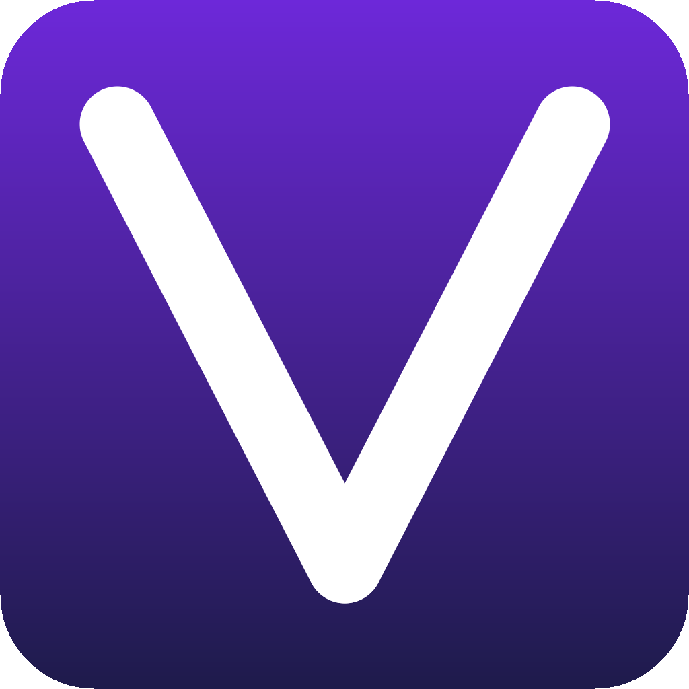

> **本仓库是 [Recordly](https://www.recordly.dev)（[webadderallorg/Recordly](https://github.com/webadderallorg/Recordly)）的二开版本 Vecord**，在原版基础上新增了以下功能：
>
> - **字幕轨道**：基于 Whisper.cpp 自动语音转文字，支持逐词高亮、字体/描边/颜色自定义、每行字符数控制、手动拆分与编辑，字幕区域跟随时间轴裁剪并写入导出视频
> - **音频独立变速**：音频轨道可单独设置播放速度且不影响音调（变速不变调）
> - **时间轴面板可调大小**：编辑器底部时间轴面板支持上下拖拽调节高度
> - **重启录制按钮**：录制工具栏新增重启录制功能
> - **独立 Web 播放器**：构建独立的 Web 播放器（`dist-viewer/`），可通过 URL 参数加载项目/视频/光标数据
> - **项目文件格式**：项目文件后缀由 `.recordly` 改为 `.vecord`，同时兼容 `.recordly` 和 `.openscreen`
> - **中文本地化**：安装包界面、编辑器 UI、导出面板等完整汉化
> - **视频压缩工具**：内置视频压缩脚本，支持调节码率/分辨率批量压缩

---

语言: [EN](README.EN.md) | 简中

<p align="center">
  
</p>

<p align="center">
  
  
</p>

### 无需额外剪辑，也能做出精致的屏幕录制。
[Recordly](https://www.recordly.dev) 是一款**开源屏幕录制器**和编辑器，适合制作**操作讲解、演示、产品视频**等内容。

https://github.com/user-attachments/assets/9b66c71d-ac97-49ff-a0c9-63ac26edf2e4

---

## Recordly 是什么？

Recordly 是一款桌面应用，用于录制并编辑屏幕内容，内置面向演示视频的动态呈现工具。你不需要再把原始素材交给动效设计师去补缩放、光标润色或样式化背景，Recordly 可以在一个地方免费完成整套流程。

Recordly 支持：

- **macOS** 14.0+
- **Windows** 10 Build 19041+
- **Linux** 现代发行版

平台说明：

- **macOS** 使用基于 ScreenCaptureKit 的原生捕获辅助程序。
- **Windows** 在支持的系统版本上使用原生 Windows Graphics Capture（WGC）辅助程序，并支持原生 WASAPI 音频。
- **Linux** 通过 Electron 捕获 API 录制。目前 Linux 还不支持隐藏真实光标。

---

# 核心功能

## 自动缩放、光标润色与样式化画面
Recordly 可以根据操作自动强调重点区域，平滑光标运动，添加动态效果，并将最终画面放进带有壁纸、纯色、渐变、模糊、留白和阴影的样式化边框中。

<p>
  
</p>

## 动态摄像头气泡叠加
你可以把摄像头素材作为气泡叠加层加入画面，使用预设位置或自定义坐标摆放，支持镜像、阴影和圆角调节，也可以让它跟随缩放变化，保证动态镜头里整体视觉更协调。

<p>
  
</p>

## 为演示设计的时间线编辑
使用拖拽式时间线工具处理缩放、裁剪、变速区域、注释、额外音频区域以及裁切感知编辑，并将工作保存为 `.vecord` 项目文件，之后随时回来继续编辑。

<p>
  
</p>

## 扩展与市场

Recordly 拥有一个社区驱动的扩展系统。任何人都可以构建和发布扩展来为 Recordly 添加新功能，例如光标点击音效、设备边框、浏览器模拟外壳、壁纸、渲染钩子、设置面板等等。

浏览并安装社区扩展：[Recordly 扩展市场](https://marketplace.recordly.dev/extensions)。

---

## 全部功能

### 录制

- 录制整个显示器或单个应用窗口
- 录制完成后直接进入编辑器
- 录制麦克风音频和系统音频
- 在支持的平台上使用原生捕获后端
- 从保存的 `.vecord` 项目文件继续编辑
- 可在应用中打开已有录像或已有项目文件

### 时间线与编辑

- 拖拽式时间线编辑
- 裁掉不需要的片段
- 添加手动缩放区域
- 根据光标活动生成自动缩放建议
- 添加加速和减速区域
- 添加文本、图片和图形注释
- 在时间线上添加额外音频区域
- 裁切录制画面
- 保存并重新打开项目，保留编辑状态

### 字幕（新增）

- 基于 Whisper.cpp 自动语音识别生成字幕
- 逐词高亮显示
- 字体、描边、颜色、背景自定义
- 每行字符数控制与自动换行
- 手动编辑和拆分字幕条目
- 字幕区域随裁剪自动偏移并写入导出视频

### 光标控制

- 显示或隐藏渲染后的光标叠加层
- 调整光标大小
- 光标平滑
- 光标运动模糊
- 点击弹跳效果
- 光标摆动效果
- 光标循环模式，方便导出更自然的循环片段
- 使用 macOS 风格的渲染光标素材

### 摄像头叠加

- 启用或禁用摄像头叠加素材
- 上传、替换或移除摄像头素材
- 镜像摄像头画面
- 调整尺寸
- 使用预设位置或自定义 X/Y 坐标
- 调整边距
- 调整圆角程度
- 调整阴影强度
- 可选的缩放联动摄像头缩放效果

### 画面样式与背景

- 内置壁纸
- 运行时自动发现 wallpapers 目录中的壁纸
- 上传自定义背景图片
- 纯色背景
- 渐变背景
- 画面留白
- 圆角
- 背景模糊
- 投影阴影
- 最终画面的宽高比预设

### 导出

- MP4 导出
- GIF 导出
- 导出质量选择
- GIF 帧率选择
- GIF 循环开关
- GIF 尺寸预设
- 宽高比和输出尺寸控制
- 在系统文件管理器中定位导出文件

### 工作流与易用性

- 可自定义键盘快捷键
- 应用内快捷键说明
- 在编辑器中直接打开反馈和问题链接
- 编辑器偏好设置持久化
- 导出后更快恢复预览

---

# 截图

<p align="center">
  
</p>

<p align="center">
  
</p>

<p align="center">
  
</p>

---

# 安装

## 下载构建版本

预构建发布版本请见：

https://github.com/Vinsea/recordly/releases

---

## 从源码构建

### 前置依赖

**macOS：** 安装 Xcode Command Line Tools（`xcode-select --install`）。

**Linux（Ubuntu / Debian）：**

```bash
sudo apt install build-essential cmake libx11-dev libxtst-dev libxrandr-dev libxt-dev
```

**Windows：** 安装 Visual Studio 2022（或 Build Tools），并勾选 C++ 工作负载和 CMake。

### 步骤

```bash
git clone https://github.com/Vinsea/recordly.git vecord
cd vecord
npm install
npm run dev
```

如果需要打包构建：

```bash
npm run build
```

也可以使用平台专用构建命令：

- `npm run build:mac`
- `npm run build:win`
- `npm run build:linux`

---

## macOS："App cannot be opened"

本地构建的应用可能会被 macOS 隔离。

可以用以下命令移除隔离标记：

```bash
xattr -rd com.apple.quarantine /Applications/Vecord.app
```

---

# 系统要求

| 平台 | 最低版本 | 说明 |
|---|---|---|
| **macOS** | macOS 14.0 (Sonoma) | 使用 ScreenCaptureKit 捕获音频和麦克风所必需。 |
| **Windows** | Windows 10 20H1（Build 19041，2020 年 5 月） | 原生 Windows Graphics Capture（WGC）辅助程序及最佳光标隐藏行为所必需。 |
| **Linux** | 任意现代发行版 | 通过 Electron 捕获录制。系统音频通常需要 PipeWire。 |

> [!IMPORTANT]
> 在 Windows 19041 之前的版本上，录制仍可能通过回退捕获方式工作，但真实系统光标可能仍会出现在视频中。

---

# 使用方法

## 录制

1. 启动 Vecord。
2. 选择屏幕或窗口。
3. 选择麦克风和系统音频选项。
4. 开始录制。
5. 停止录制后进入编辑器。

## 编辑

在编辑器中，你可以：

- 添加裁剪、缩放、变速区域和注释
- 调整光标行为和预览音量
- 使用壁纸、纯色、渐变、模糊、留白和圆角来美化画面
- 添加或调整摄像头叠加素材
- 添加额外音频区域
- 裁切画面并选择宽高比
- 添加字幕轨道并自定义样式

你可以随时将工作保存为 `.vecord` 项目。

## 导出

支持以下导出格式：

- **MP4**，适合常规视频输出
- **GIF**，适合轻量分享和循环片段

你可以在导出前调整格式相关设置，例如质量、GIF 帧率、GIF 循环方式和输出尺寸。

---

# 限制

### 光标捕获

Vecord 会在录制画面上渲染一个经过美化的光标叠加层，但真实系统光标是否能被隐藏仍取决于平台能力。

**macOS**
- ScreenCaptureKit 可以较干净地排除真实光标。

**Windows**
- 最佳效果需要 Windows 10 Build 19041+ 和原生捕获辅助程序。
- 较旧版本会回退到 Electron 捕获，因此真实光标可能仍会显示。

**Linux**
- Electron 桌面捕获目前不支持隐藏真实光标。
- 如果同时启用渲染光标叠加，导出中可能会同时看到真实光标和样式化光标。

### 系统音频

系统音频支持因平台而异。

**Windows**
- 原生 WASAPI 支持

**Linux**
- 通常需要 PipeWire

**macOS**
- 需要 macOS 14.0+ 和基于 ScreenCaptureKit 的工作流

---

# 工作原理

Vecord 将平台相关的捕获层与基于渲染器的编辑、导出流程结合在一起。

**捕获**
- Electron 负责录制流程和应用级控制
- macOS 使用原生 ScreenCaptureKit 辅助程序
- Windows 在可用时使用原生 Windows Graphics Capture（WGC）辅助程序和原生音频辅助程序

**编辑**
- 时间线区域定义缩放、裁剪、变速、音频叠加、字幕和注释
- 光标和摄像头样式都保存在编辑器状态中

**渲染**
- 场景合成由 **PixiJS** 负责

**导出**
- 预览使用的同一套场景逻辑会被用于导出 MP4 或 GIF

**项目**
- `.vecord` 文件会保存源媒体路径和编辑器状态，方便后续继续编辑

---

# 贡献

本仓库为个人二开版本，不接受外部 PR。  
如需贡献原版功能，请前往 [webadderallorg/Recordly](https://github.com/webadderallorg/Recordly)。

---

# 许可证

基于 [Recordly](https://github.com/webadderallorg/Recordly) 二开，遵循 **AGPL 3.0** 协议。

---

# 致谢

<p>
  <a href="https://www.recordly.dev">
    
  </a>
</p>

感谢 [@webadderall](https://x.com/webadderall) 创建并开源 [Recordly](https://www.recordly.dev)。  
Recordly 最初从 [OpenScreen](https://github.com/siddharthvaddem/openscreen) 分叉而来。
